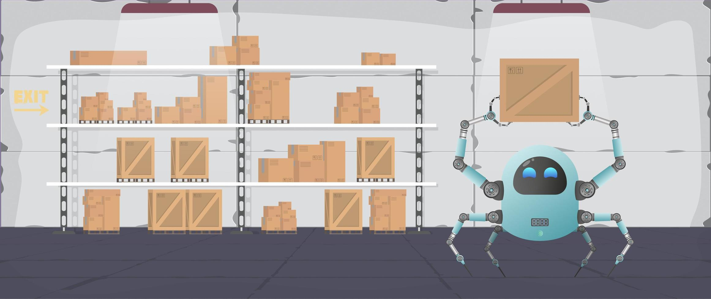

# Simulación de Clasificación de Cajas con Agentes en Jupyter Notebook

Este Jupyter Notebook implementa una simulación en la que agentes autónomos colaboran para clasificar cajas en pilas de un máximo de 5 cajas cada una. La simulación recopila información sobre el tiempo necesario hasta que todas las cajas están en su lugar y el número total de movimientos realizados por los robots.

